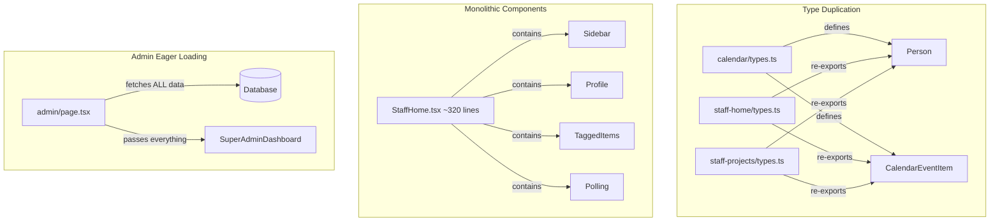

# Design Document: Code Quality Refactor

## Overview

This design document describes the technical architecture for refactoring the LOIND-WORKSPACE internal project management application. The refactoring targets ten areas: metadata/branding, type consolidation, constants consolidation, font loading optimization, component decomposition, polling optimization, optimistic update error handling, admin lazy loading, auth guard cleanup, and unused file removal.

The application is built on Next.js 16.3 (App Router), TypeScript 5, Tailwind CSS 4, Prisma 7.9, and NextAuth v5. All changes maintain existing user-facing behavior while improving code quality, maintainability, and performance.

**Key Design Principles:**
- No new third-party dependencies (leverage existing libraries and standard patterns)
- Incremental changes that can be verified individually via `next build`
- Single source of truth for types, constants, and fonts
- Composition over monolithic components

## Architecture

### Current Architecture Issues



### Target Architecture

```mermaid
graph TD
    subgraph "Canonical Types"
        SharedTS[src/types/shared.ts] -->|defines| Person
        SharedTS -->|defines| CalendarEventItem
        SharedTS -->|defines| ProjectSummary
        SHT2[staff-home/types.ts] -->|imports from| SharedTS
        SPT2[staff-projects/types.ts] -->|imports from| SharedTS
        CT2[calendar/types.ts] -->|removed, replaced by| SharedTS
    end

    subgraph "Decomposed StaffHome"
        SH2[StaffHome.tsx ~80 lines] -->|composes| DL[DashboardLayout]
        DL -->|renders| PS[ProjectSidebar]
        DL -->|renders| PC[ProfileCard]
        DL -->|renders| TI[TaggedItemsList]
        DL -->|renders| DN[DashboardNav]
    end

    subgraph "Admin Lazy Loading"
        AP2[admin/page.tsx] -->|fetches stats only| DB2[(Database)]
        AP2 -->|passes stats| SAD2[SuperAdminDashboard]
        SAD2 -->|on tab switch| API[/api/admin/*]
    end
```

### File Structure After Refactoring

```
src/
├── types/
│   ├── next-auth.d.ts (existing)
│   └── shared.ts (NEW)
├── lib/
│   ├── constants.ts (NEW)
│   ├── prisma.ts (existing)
│   ├── auth-guards.ts (MODIFIED - JSDoc annotations)
│   └── hooks/
│       └── usePolling.ts (NEW)
├── components/
│   ├── ui/
│   │   └── Toast.tsx (NEW - shared)
│   ├── layout/
│   │   ├── DashboardLayout.tsx (NEW)
│   │   ├── DashboardNav.tsx (NEW)
│   │   └── ProjectSidebar.tsx (NEW)
│   ├── staff-home/
│   │   ├── StaffHome.tsx (REFACTORED - <100 lines)
│   │   ├── ProfileCard.tsx (NEW)
│   │   ├── TaggedItemsList.tsx (NEW)
│   │   ├── WorkStationPanel.tsx (MODIFIED - imports from constants)
│   │   ├── MemoPanel.tsx (unchanged)
│   │   ├── MusicWidget.tsx (unchanged)
│   │   └── types.ts (MODIFIED - imports from shared)
│   ├── staff-projects/
│   │   ├── ProjectContent.tsx (MODIFIED - optimistic rollback)
│   │   ├── KanbanBoard.tsx (MODIFIED - imports from constants)
│   │   └── types.ts (MODIFIED - imports from shared)
│   ├── super-admin/
│   │   ├── SuperAdminDashboard.tsx (MODIFIED - lazy loading)
│   │   └── Toast.tsx (REMOVED - replaced by ui/Toast.tsx)
│   ├── calendar/
│   │   └── types.ts (REMOVED - replaced by shared.ts)
│   └── ...
├── app/
│   ├── layout.tsx (MODIFIED - fonts, metadata, lang)
│   ├── favicon.svg (NEW)
│   ├── admin/
│   │   └── page.tsx (MODIFIED - stats-only fetch)
│   └── api/
│       └── admin/
│           ├── accounts/route.ts (NEW)
│           ├── companies/route.ts (NEW)
│           ├── projects/route.ts (NEW)
│           └── records/route.ts (NEW)
└── ...
public/
├── favicon.svg (NEW)
docs/
└── design/
    └── loind-color-system.html (MOVED from root)
```

## Components and Interfaces

### 1. Shared Types (`src/types/shared.ts`)

```typescript
import type { ProjectStatus } from "@/generated/prisma/enums";

export interface Person {
  id: string;
  name: string | null;
  email: string;
}

export interface CalendarEventItem {
  id: string;
  title: string;
  startAt: string;
  endAt: string | null;
  sharedWith: string[];
  owner: Person;
  projectId?: string | null;
}

export interface ProjectSummary {
  id: string;
  name: string;
  status: ProjectStatus;
  summary?: string | null;
  statusNote?: string | null;
}
```

The `ProjectSummary` type unifies both the staff-home version (only `id`, `name`, `status`) and the staff-projects version (adds `summary`, `statusNote`) by making the extra fields optional.

### 2. Shared Constants (`src/lib/constants.ts`)

```typescript
import type { TaskPriority, TaskStatus } from "@/generated/prisma/enums";

export const STATUS_LABEL: Record<TaskStatus, string> = {
  WAIT: "대기",
  IN_PROGRESS: "진행",
  REVIEW: "검토",
  FEEDBACK: "피드백",
  DONE: "완료",
};

export const STATUS_STYLE: Record<TaskStatus, string> = {
  WAIT:        "badge-wait",
  IN_PROGRESS: "badge-progress",
  REVIEW:      "badge-review",
  FEEDBACK:    "badge-feedback",
  DONE:        "badge-done",
};

export const PRIORITY_DOT: Record<TaskPriority, string> = {
  HIGH:   "bg-[#c9595a]",
  NORMAL: "bg-[#8fa8c4]",
  LOW:    "bg-white/20",
};

export const STATUS_ORDER: TaskStatus[] = [
  "WAIT", "IN_PROGRESS", "REVIEW", "FEEDBACK", "DONE"
];
```

### 3. Polling Hook (`src/lib/hooks/usePolling.ts`)

```typescript
interface UsePollingOptions<T> {
  url: string;
  interval: number;
  enabled: boolean;
  onData: (data: T) => void;
}

interface UsePollingReturn {
  isPolling: boolean;
  refresh: () => Promise<void>;
}

export function usePolling<T>(options: UsePollingOptions<T>): UsePollingReturn;
```

**Design Decisions:**
- Uses `setInterval` + `fetch` (no new dependencies like SWR/React Query)
- `enabled` flag starts/stops polling without unmounting
- Cleans up interval on unmount or when `enabled` changes to `false`
- `refresh` allows immediate re-fetch on demand
- Automatically pauses when the browser tab is hidden (using `document.visibilityState`)

### 4. Toast Component (`src/components/ui/Toast.tsx`)

```typescript
export type ToastType = "success" | "error" | "info";

interface ToastItem {
  id: string;
  message: string;
  type: ToastType;
}

interface ToastProps {
  toasts: ToastItem[];
  onDismiss: (id: string) => void;
}

export function ToastContainer(props: ToastProps): JSX.Element;

// Hook for managing toast state
export function useToast(): {
  toasts: ToastItem[];
  show: (message: string, type?: ToastType) => void;
  dismiss: (id: string) => void;
};
```

**Design:**
- Positioned fixed at bottom-right
- Auto-dismiss after 3 seconds
- Supports stacking multiple toasts
- Icons: ✓ for success, ✕ for error, ℹ for info
- Uses brand colors: success = `#5ba08a`, error = `#c9595a`, info = `#8fa8c4`
- Animations: slide-up on enter, fade-out on exit

### 5. Extracted Layout Components

#### DashboardNav

```typescript
interface DashboardNavProps {
  currentUser: { name: string | null; email: string; role: Role };
  unreadCount: number;
  onNotificationsClick: () => void;
}
```

Renders the top navigation bar with LOIND branding, admin link (for SUPER_ADMIN), music widget, notification bell, and user menu.

#### ProjectSidebar

```typescript
interface ProjectSidebarProps {
  projects: ProjectSummary[];
  activeView: string;
  onSelectView: (id: string) => void;
}
```

Renders the project list sidebar with home button, active projects, and collapsible done projects section.

#### ProfileCard

```typescript
interface ProfileCardProps {
  currentUser: { name: string | null; email: string; role: Role };
  openCount: number;
  doneCount: number;
  upcomingEvents: number;
}
```

Renders the user avatar, name, role badge, and statistics (open tasks, done tasks, upcoming events).

#### TaggedItemsList

```typescript
interface TaggedItemsListProps {
  items: TaggedItem[];
}
```

Renders the "내게 배정된 항목" list with kind icons and project labels.

#### DashboardLayout

```typescript
interface DashboardLayoutProps {
  nav: React.ReactNode;
  sidebar: React.ReactNode;
  main: React.ReactNode;
  rightPanel: React.ReactNode;
}
```

Provides the overall grid structure: nav at top, sidebar on left inside the glass panel, main content area, and right info panel.

### 6. Admin Lazy Loading Architecture

**Current Flow:**
```
admin/page.tsx (server) → fetches ALL data → passes to SuperAdminDashboard
```

**Target Flow:**
```
admin/page.tsx (server) → fetches stats + overview only → passes to SuperAdminDashboard
SuperAdminDashboard (client) → on tab switch → fetch /api/admin/{tab}
                             → cache in component state
                             → show skeleton while loading
```

**New API Routes:**

| Route | Returns |
|-------|---------|
| `GET /api/admin/accounts` | `{ users: AdminUserItem[] }` |
| `GET /api/admin/companies` | `{ companies: CompanyItem[] }` |
| `GET /api/admin/projects` | `{ projects: AdminProjectItem[], staff: StaffOption[] }` |
| `GET /api/admin/records` | `{ projects: AdminProjectItem[] }` |

Each route uses `requireSuperAdmin()` for auth. Data is cached in `SuperAdminDashboard` state once fetched — subsequent tab switches use cached data without re-fetching.

### 7. Optimistic Update Pattern in ProjectContent

```typescript
// Generalized pattern for all optimistic operations
async function optimisticAction<T>(
  getCurrentState: () => T,
  setOptimisticState: (state: T) => void,
  computeOptimistic: (current: T) => T,
  apiCall: () => Promise<Response>,
  showError: (msg: string) => void,
) {
  const previous = getCurrentState();
  setOptimisticState(computeOptimistic(previous));
  try {
    const res = await apiCall();
    if (!res.ok) throw new Error();
  } catch {
    setOptimisticState(previous);
    showError("작업에 실패했습니다. 다시 시도해주세요.");
  }
}
```

Applied to three operations in ProjectContent:
- `onStatusChange` — revert task status on failure
- `onReorder` — revert task order on failure
- `onEdit` — revert edited fields on failure

An `inFlight` ref prevents duplicate submissions while a request is pending.

### 8. Font Loading Strategy

**Root Layout (`layout.tsx`):**

```typescript
import { Geist, Geist_Mono } from "next/font/google";
import { Bebas_Neue, DM_Sans } from "next/font/google";

const geistSans = Geist({ variable: "--font-geist-sans", subsets: ["latin"] });
const geistMono = Geist_Mono({ variable: "--font-geist-mono", subsets: ["latin"] });
const bebasNeue = Bebas_Neue({ variable: "--font-bebas", subsets: ["latin"], weight: "400" });
const dmSans = DM_Sans({ variable: "--font-dm-sans", subsets: ["latin"], weight: ["300","400","500","600","700"] });

// Applied to <html> className:
// `${geistSans.variable} ${geistMono.variable} ${bebasNeue.variable} ${dmSans.variable}`
```

**CSS Variables in `globals.css`:**
```css
@theme inline {
  --font-sans: var(--font-geist-sans);
  --font-mono: var(--font-geist-mono);
  --font-bebas: var(--font-bebas);
  --font-dm: var(--font-dm-sans);
}
```

**Component Usage:**
- Instead of `className={bebasNeue.className}`, use `className="font-[family-name:var(--font-bebas)]"`
- Or define Tailwind utilities: `font-bebas` → `font-family: var(--font-bebas)`

### 9. Favicon Design

SVG favicon (`public/favicon.svg`):
- Viewbox: `0 0 32 32`
- Background: rounded rectangle with `#0e1116` fill
- Letter "L": rendered in `#8fa8c4` (brand-light), Bebas Neue style (tall, condensed)
- Clean geometric lines matching the LOIND brand aesthetic

Referenced in `layout.tsx` metadata:
```typescript
export const metadata: Metadata = {
  title: "LOIND WORKS",
  description: "LOIND Corporation 내부 워크스페이스",
  icons: { icon: "/favicon.svg" },
};
```

## Data Models

No database schema changes are required. All refactoring is at the application layer.

The only data-related changes are:
1. **Type consolidation** — unifying `ProjectSummary` into a single interface with optional fields
2. **API route additions** — new routes that expose existing Prisma queries for lazy loading

## Error Handling

### Optimistic Update Rollback

All three optimistic operations (`onStatusChange`, `onReorder`, `onEdit`) in `ProjectContent` follow this error handling pattern:

1. Capture previous state before mutation
2. Apply optimistic state immediately
3. Execute API call
4. On failure: restore previous state + show error toast
5. Track in-flight state to prevent duplicate submissions

### Polling Error Handling

The `usePolling` hook handles errors silently — a failed poll does not disrupt the UI or show errors to the user. The next poll cycle will attempt again. This matches the current behavior where the 8-second interval simply skips failed fetches.

### Admin Lazy Loading Errors

When a tab's data fetch fails:
- Display an error state within the tab panel (not a global error)
- Provide a "다시 시도" (retry) button
- Do not cache failed responses

### Toast Feedback

The shared Toast component is used for:
- Optimistic update rollback notifications (error type)
- Admin dashboard action confirmations (success type)
- Generic operation feedback (info type)

## Testing Strategy

### Why Property-Based Testing Does NOT Apply

This refactoring spec involves:
- Moving type definitions between files (structural)
- Extracting components (UI composition)
- Adding error handling to existing patterns (UI state)
- Consolidating constants (configuration)
- Lazy loading tab data (UI behavior)
- File cleanup (housekeeping)

None of these create pure functions with meaningful input variation or universal properties. The correctness guarantee is primarily **build-time verification** (TypeScript compilation + Next.js build), supplemented by targeted unit tests.

### Testing Approach

**Build Verification (Primary):**
- `next build` must succeed after each logical group of changes
- TypeScript compiler (`tsc --noEmit`) reports zero errors
- This verifies type consolidation, import correctness, and component interfaces

**Unit Tests (Example-Based):**
- `usePolling` hook: test that polling starts/stops when `enabled` changes
- `usePolling` hook: test that interval clears on unmount
- `useToast` hook: test show/dismiss/auto-dismiss behavior
- Optimistic update helpers: test rollback on simulated failure
- Constants: verify all enum values are covered

**Integration Tests (Manual/E2E):**
- Verify StaffHome renders correctly after decomposition
- Verify admin tabs load data on switch and cache correctly
- Verify optimistic updates roll back visually on network failure
- Verify fonts render correctly via CSS variables

**Lint/Static Analysis:**
- ESLint passes with existing configuration
- No unused imports after cleanup
- No circular dependencies introduced

### Verification Checkpoints

Each major task group should be verified with:
```bash
npx next build
```

This single command validates TypeScript types, module resolution, component rendering (RSC/Client boundaries), and CSS processing — catching the majority of potential regressions from this refactoring.
