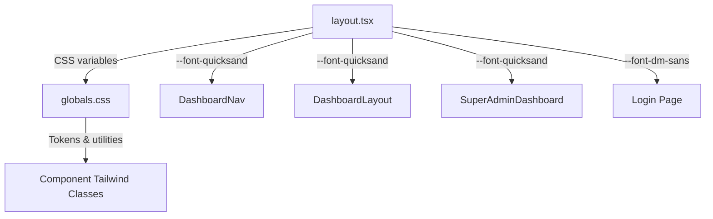

# Design Document: UI/UX Design Polish

## Overview

This design covers a comprehensive visual polish pass on the LOIND-WORKSPACE Next.js application. The changes affect font system, typography sizing, touch targets, visual feedback states, spacing consistency, button unification, and color contrast — all within the existing dark-themed glassmorphism aesthetic.

The primary visual change is replacing Bebas Neue logo font with **Quicksand Bold (700 weight, tracking-tight)** for a friendlier brand presence.

## Architecture

The changes are purely presentational — no data models, API endpoints, or business logic are modified. The design system lives in:

1. **`src/app/layout.tsx`** — Central font registration (Next.js `next/font/google`)
2. **`src/app/globals.css`** — Design tokens, utility classes, component styles
3. **Component files** — Tailwind classes consuming the design tokens



## Components and Interfaces

### Font System Changes

| Font | Variable | Usage | Change |
|------|----------|-------|--------|
| Quicksand | `--font-quicksand` | Logo text ("LOIND", "LOIND CORPORATION") | **NEW** — replaces Bebas Neue for logos |
| Bebas Neue | `--font-bebas` | _(deprecated for logos)_ | Keep registered for backwards compatibility |
| DM Sans | `--font-dm-sans` | Body text, login page | No change (remove local duplicate in login) |
| Geist | `--font-geist-sans` | System UI | No change |
| Geist Mono | `--font-geist-mono` | Monospace labels | No change |

**Quicksand Registration in `layout.tsx`:**
```tsx
import { Quicksand } from "next/font/google";

const quicksand = Quicksand({
  variable: "--font-quicksand",
  subsets: ["latin"],
  weight: "700",
});
```

Add `${quicksand.variable}` to the `<html>` className.

### Logo Text Pattern

All logo instances change from:
```
font-[family-name:var(--font-bebas)] tracking-widest
```
to:
```
font-[family-name:var(--font-quicksand)] font-bold tracking-tight
```

Affected components:
- `DashboardNav` — "LOIND"
- `DashboardLayout` — "LOIND CORPORATION"
- `SuperAdminDashboard` — "LOIND"

### Button Variants (globals.css)

Three unified button classes:

```css
.btn-primary {
  background: linear-gradient(135deg, rgba(143, 168, 196, 0.22), rgba(85, 104, 155, 0.18));
  border: 1px solid rgba(143, 168, 196, 0.38);
  color: #c3d3e6;
  font-size: 12px;
  font-weight: 600;
  padding: 8px 12px;
  border-radius: 8px;
  cursor: pointer;
  transition: all 0.18s ease;
}
.btn-primary:hover {
  background: linear-gradient(135deg, rgba(143, 168, 196, 0.35), rgba(85, 104, 155, 0.28));
}

.btn-secondary {
  background: rgba(255, 255, 255, 0.04);
  border: 1px solid rgba(255, 255, 255, 0.09);
  color: rgba(255, 255, 255, 0.6);
  font-size: 12px;
  font-weight: 600;
  padding: 8px 12px;
  border-radius: 8px;
  cursor: pointer;
  transition: all 0.18s ease;
}
.btn-secondary:hover {
  background: rgba(255, 255, 255, 0.09);
  color: #fff;
}

.btn-danger {
  background: rgba(201, 89, 90, 0.1);
  border: 1px solid rgba(201, 89, 90, 0.22);
  color: #e07070;
  font-size: 12px;
  font-weight: 600;
  padding: 8px 12px;
  border-radius: 8px;
  cursor: pointer;
  transition: all 0.18s ease;
}
.btn-danger:hover {
  background: rgba(201, 89, 90, 0.2);
}
```

### Typography Floors

| Element | Current | Target |
|---------|---------|--------|
| Monospace labels (`admin-tbl th`, section headers) | 9px | 10px |
| Status/filter badges | 9-10px | 10px minimum |
| Task titles | 12px (text-xs) | 13px (text-[13px]) |
| Body text minimum | - | 11px |
| Low-opacity text | white/20, white/25 | white/40 minimum |
| Medium-opacity text | white/30 | white/45 minimum |

### Touch Targets

| Element | Current | Target |
|---------|---------|--------|
| All interactive elements min height | varies | 32px |
| Sidebar project buttons | py-2 | py-2.5 |
| WorkStation add button | h-7 w-7 | h-8 w-8 |
| Filter pills | py-0.5 | py-1 |
| Status dropdown items | px-3 py-1 | py-2 px-4 |

### Visual Feedback

| Interaction | Implementation |
|-------------|---------------|
| Active sidebar item | `border-l-[3px] border-brand-light` + existing bg |
| Kanban card hover | Add `hover:scale-[1.01]` to `.kanban-card:hover` |
| Active nav item | Bottom border indicator (already partial, ensure consistent) |
| Focus ring | `focus-visible:ring-2 focus-visible:ring-brand-light/40 focus-visible:outline-none` on interactive elements |
| Hover opacity boost | +20 percentage points on interactive text |

### Spacing & Layout

| Element | Current | Target |
|---------|---------|--------|
| Sidebar width | w-48 (192px) | w-52 (208px) |
| Standard content gap | varies | gap-6 (24px) |
| Card minimum padding | p-3 | p-4 (16px) |
| Border radius (panels) | rounded-2xl | rounded-2xl (16px) ✓ |
| Border radius (cards) | rounded-xl | rounded-xl (12px) ✓ |
| Border radius (buttons/inputs) | varies | rounded-lg (8px) |

### Login Page Fix

Remove local `DM_Sans` import and `dmSans.className` usage. Replace with centralized CSS variable:

```tsx
// Remove:
import { DM_Sans } from "next/font/google";
const dmSans = DM_Sans({ ... });

// Change className from:
className={`${dmSans.className} ...`}
// To:
className="font-[family-name:var(--font-dm-sans)] ..."
```

## Data Models

No data model changes. This feature is purely presentational.

## Error Handling

- If Quicksand font fails to load (network issue), the browser falls back to `system-ui, sans-serif` per the existing font stack.
- All CSS changes are additive — existing glass/card/badge classes remain intact.
- The `--font-bebas` variable remains registered for any future use or third-party references.

## Testing Strategy

### Why Property-Based Testing Does NOT Apply

This feature is entirely UI rendering and styling. Changes consist of:
- CSS class modifications
- Font family swaps
- Spacing/sizing adjustments
- Visual state styling

These are not functions with input/output behavior amenable to universal properties. There is no transformation logic, no data processing, and no serialization.

### Recommended Testing Approach

1. **Build verification**: `next build` must pass after all changes (catches type errors, import issues)
2. **Visual regression** (manual): Compare before/after screenshots of:
   - Login page
   - Dashboard (home view)
   - Kanban board
   - Super Admin dashboard
3. **Accessibility spot check**: Verify focus rings are visible on keyboard navigation
4. **Responsive check**: Confirm touch targets meet 32px minimum on mobile viewport

### Test Scope Per Requirement

| Requirement | Verification Method |
|-------------|-------------------|
| R1: Logo Font | Visual inspection — Quicksand Bold, tracking-tight |
| R2: Typography | DevTools audit — no text below 11px, opacity floors met |
| R3: Touch Targets | DevTools computed styles — min 32px height |
| R4: Visual Feedback | Keyboard navigation + hover states |
| R5: Spacing | DevTools layout inspection |
| R6: Login Font | Build passes, no local DM_Sans import |
| R7: Color Contrast | Visual hierarchy clear in screenshots |
| R8: Button Styles | Visual consistency across pages |
| R9: Non-functional | `next build` succeeds, no new deps |
